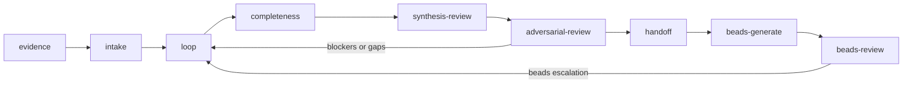
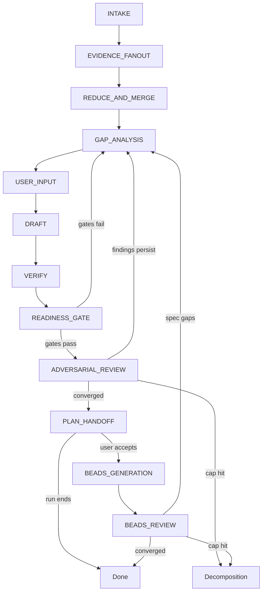
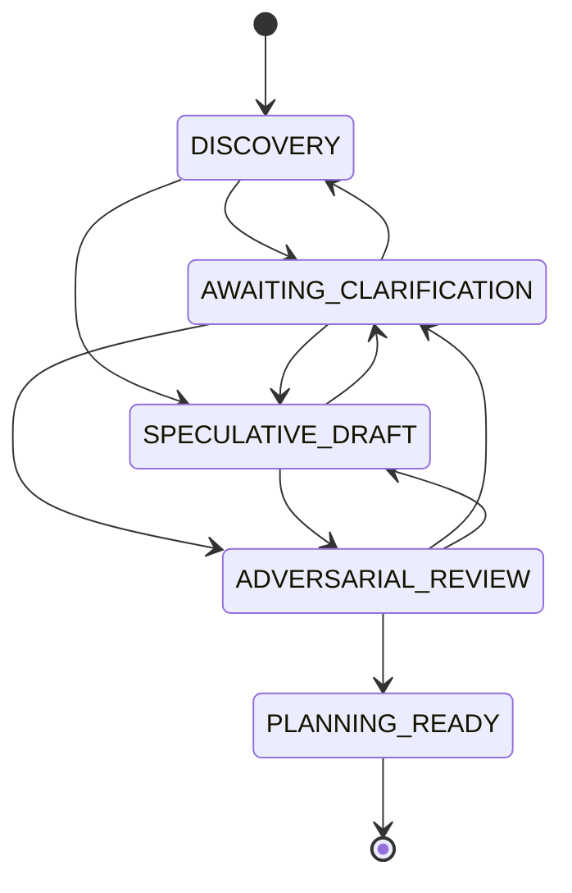

# Forge

Turn a feature request into an implementation-ready spec — stress-tested before any code is written. Then run autonomous improvement loops with blind scoring.

## The problem

AI-generated specs hallucinate decisions. They fill in blanks with plausible-sounding answers instead of flagging them as open questions. The implementer — human or agent — hits gaps, invents answers on the fly, and ships something that doesn't match what anyone intended.

Nobody stress-tests the spec before handoff. By the time contradictions and missing edge cases surface, they're already bugs.

## What Forge does differently

- **Everything starts as evidence.** Code, docs, transcripts, screenshots — classified and tracked, not summarized away.
- **One reducer writes canon.** Sub-agents explore and review. Only the lead agent merges findings into the spec. No conflicting rewrites.
- **Provenance is required.** Every canonical claim traces back to the evidence that supports it. Unsupported claims get flagged, not shipped.
- **Readiness is a state machine.** Not a score threshold — a formal model with blocker rules, planning states, and handoff gates.
- **Adversarial review before handoff.** Dynamic agent teams probe for ambiguity, contradictions, and untestable claims. The spec doesn't ship until they find nothing.
- **Design tree walks.** Clarification and research sub-agents walk the codebase's design tree (directory structure, module boundaries, naming conventions) to ground questions in what actually exists.
- **Learning artifacts feed forward.** Per-bead learnings from `.ralph-tui/progress.md` are consumed by the planning pipeline, so each spec benefits from patterns discovered in prior implementations.
- **Autoresearch loops.** Autonomous iterative improvement with blind scoring — doer/judge/arbiter/strategist cycles that self-replicate until convergence.

## What you get

A **subject spec** — a specification document named after its subject (e.g. `auth-session-system.md`) — with sidecar artifacts:

- The spec itself with provenance-linked claims
- An evidence ledger (JSONL) of every input processed
- Readiness metadata (scores, blocker reasons, planning/handoff state)
- An implementation plan with acceptance criteria
- A ubiquitous language glossary (`UBIQUITOUS-LANGUAGE.md`) for consistent domain terminology
- Optional **beads** — discrete implementation work units with dependency wiring, including epilogue beads for post-implementation learning

> **See a finished example:** [`specs/feature-flags-system.md`](specs/feature-flags-system.md)
> with full artifacts in [`specs/_artifacts/feature-flags-system/`](specs/_artifacts/feature-flags-system/).

## Quick start

### Prerequisites

- Claude Code (`claude`) or Codex (`codex`)
- `bash`, `git`, `python3` (for manual/shell install only)

### Install

**Claude Code (recommended):**

```
/plugin marketplace add mwarger/forge
/plugin install forge@forge-dev
```

All 10 skills are available immediately. Update with `/plugin update forge`.

**Codex:**

```
Fetch and follow instructions from https://raw.githubusercontent.com/mwarger/forge/main/.codex/INSTALL.md
```

### Your first spec

Start a new session after install and just describe what you want. Forge triggers automatically — no special syntax needed:

```text
Forge a feature to add real-time notifications
Forge a fix for the auth token refresh bug
Forge a migration from REST to GraphQL
Forge a refactor of the payment processing module
Reverse engineer this repo into a spec
```

Or be more explicit if you prefer:

```text
Create a subject-named spec for this feature request using Forge.
Use the forge-orchestrator skill on this codebase.
```

Works in both Claude Code (`claude`) and Codex (`codex`). The orchestrator skill triggers and routes into the focused sub-skills automatically.

<details>
<summary>Advanced install options (manual / shell / remote)</summary>

**Manual / shell:**

```bash
./install.sh
```

This installs the skills into your detected skills dir and a helper command `forge-pack`.

Useful env vars:

```bash
FORGE_INSTALL_MODE=copy ./install.sh
FORGE_SKILLS_DIR="$HOME/.claude/skills" ./install.sh
FORGE_SKILLS_DIR="$HOME/.codex/skills" ./install.sh
```

**Remote install:**

```bash
curl -fsSL "https://raw.githubusercontent.com/mwarger/forge/main/install.sh?$(date +%s)" | bash
```

**Platform-specific install docs:**
- Claude Code: [`.claude/INSTALL.md`](.claude/INSTALL.md)
- Codex: [`.codex/INSTALL.md`](.codex/INSTALL.md)

The installer auto-detects the target platform:
- If `~/.claude/` exists → installs to `~/.claude/skills/`
- If `~/.codex/` exists → installs to `~/.codex/skills/`
- Override with `FORGE_SKILLS_DIR`

By default the installer uses symlinks so local edits in this repo are visible immediately in the installed skills.

</details>

## How it works



Evidence flows in, gets classified and tracked, then moves through iterative refinement loops. The spec is scored against a 12-dimension ontology, stress-tested by adversarial agent teams, and only handed off when readiness gates pass. Optional beads decompose the plan into implementation work units.

## Key concepts

| Term | Meaning |
|------|---------|
| **Subject spec** | A specification document named after its subject (e.g. `auth-session-system.md`). The primary output of a Forge run. |
| **Evidence** | Any input material — code, docs, transcripts, screenshots, URLs, or user statements — that the spec is built from. |
| **Canon** | The authoritative merged state of the spec. Only the lead agent (the "reducer") writes to canon. |
| **Reducer** | The lead agent role that merges sub-agent outputs into the canonical spec. Sub-agents explore and review; only the reducer writes final text. |
| **Sub-agent** | A spawned agent that performs bounded exploration, review, or adversarial testing. Reports findings back to the reducer. |
| **Provenance** | A trace from any canonical claim back to the evidence that supports it. Required before text becomes part of canon. |
| **Beads** | Discrete implementation work units (`br` beads) decomposed from the plan, with dependency wiring and spec-claim mapping. |
| **Epilogue beads** | Meta-beads for post-implementation quality tasks (retrospectives, agent guidance). Depend on all implementation beads; may spawn follow-up beads. |
| **Ubiquitous language** | A domain glossary (`UBIQUITOUS-LANGUAGE.md` at project root) created during intake and updated throughout the pipeline. All beads and spec text use these terms. |
| **Evidence ledger** | A JSONL log of every evidence unit processed during a run. |
| **Autoresearch loop** | A four-bead cycle (doer/judge/arbiter/strategist) that self-replicates for autonomous iterative improvement with blind scoring. |

## Skills

| Skill | Role |
|-------|------|
| `forge-orchestrator` | Top-level orchestrator — routes through sub-skills, manages state transitions, acts as the sole reducer of canon |
| `forge-intake` | Normalize inputs into a subject spec run — classify archetype, seed evidence ledger, create readiness skeleton |
| `forge-loop` | Process evidence one unit at a time, ask clarifying questions, emit speculative variants when blockers remain |
| `forge-completeness` | Score the spec against a 12-dimension ontology with sub-signal requirements, enforce 80/80 gates |
| `forge-synthesis-review` | Merge sub-agent outputs into canon, run 4 review passes (completeness, contradiction, provenance, implementability) |
| `forge-adversarial-review` | Stress-test the spec with dynamic agent teams — section agents for depth, cross-cutting agents for coherence — until zero findings or decomposition |
| `forge-plan-handoff` | Render the implementation plan if eligible, or emit a withheld handoff with next steps if blocked |
| `forge-beads-generate` | Decompose implementation plan into beads with dependency wiring, epic grouping, and provenance labels |
| `forge-beads-review` | Stress-test beads for coverage, granularity, dependencies, and actionability using adversarial agent teams |
| `forge-autoresearch` | Stamp a self-replicating four-bead autoresearch loop for autonomous iterative improvement with blind scoring |

## User stories

### US-1: Review-and-fix loop (epilogue cycle)

**As a** developer running beads through ralph-loop,
**I want** review beads that find issues and automatically create fix beads,
**so that** quality issues are caught and resolved without human intervention.

**Flow:**
1. All implementation beads complete
2. Full Code Review epilogue bead spawns agent team (bug hunter, coverage verifier, simplifier, convention checker)
3. Each material finding becomes a follow-up bead (`--parent <epic-id> --labels "forge:<subject>,epilogue-followup"`)
4. Follow-up beads are implemented by the next ralph-loop pass
5. New Full Code Review scoped to only the follow-up changes
6. Repeat until zero findings or max 3 cycles

**Acceptance criteria:**
- Review findings produce actionable beads, not just reports
- Each follow-up bead depends on the bead whose code it fixes
- Cycle is scoped (only reviews code changed in that cycle, not entire epic)
- Max 3 cycles with escalation to human if convergence fails
- `beads-manifest.json` `followup_beads` array updated after each cycle

---

### US-2: Research fanout beads (context-efficient exploration)

**As a** user running a spec pipeline or autoresearch loop,
**I want** research beads that spawn bounded fanout tasks for exploration,
**so that** the main loop stays context-efficient while deep research happens in parallel.

**Flow:**
1. A doer or strategist identifies a research need (design tree walk, deep-dive, pattern cloning)
2. Instead of bloating its own context, it stamps a research bead under the same epic
3. Research bead types:
   - **Design tree walk** — explore codebase structure (directory layout, module boundaries, naming conventions) to ground decisions in what actually exists
   - **Deep research** — investigate a specific technical question with focused file reads and web searches
   - **Pattern cloning** — find existing implementations of a pattern in the codebase and extract the reusable structure
4. Research bead writes findings to a well-known path (`.autoresearch/research-<N>.md`)
5. The next doer/strategist reads the findings file — fresh context, no bloat

**Acceptance criteria:**
- Research beads are `--labels "forge:<subject>,role:research"`
- Findings written to disk, not passed through bead descriptions
- Research beads get read-only tools (Read, Bash, Grep, Glob) — no writes
- ralph-loop routes `role:research` to a fast/cheap model (haiku)
- Strategist can stamp research beads as pre-dependencies for the next doer

---

### US-3: Bead improvement beads (self-modification)

**As a** developer using the epilogue cycle,
**I want** beads that can CRUD other beads within the loop,
**so that** the system improves its own work decomposition and quality processes.

**Flow — three epilogue bead types:**

**A) Learnings Retrospective:**
1. Scans `.ralph-tui/progress.md`, git history, original spec
2. Synthesizes per-bead learnings into structured findings
3. Creates follow-up beads for actionable process improvements
4. Updates project memory (patterns, antipatterns)

**B) Agent Guidance Review:**
1. Audits AGENTS.md, progress.md, project skills, SKILL.md files
2. Identifies conflicting rules, gaps, stale guidance
3. Updates guidance artifacts (AGENTS.md, UBIQUITOUS-LANGUAGE.md, `.claude/skills/`)
4. Creates follow-up beads for code changes required by guidance updates

**C) Full Code Review:**
1. Spawns 4-agent team (bug hunter, coverage verifier, simplifier, convention checker)
2. Convergence rounds until zero material findings (max 3 rounds)
3. Creates follow-up beads for every material finding
4. Each follow-up bead has: title, finding details, remediation steps, dependency on source bead

**Acceptance criteria:**
- All three epilogue types can create, read, update bead descriptions via `br` CLI
- Follow-up beads use exact contract: `--parent <epic-id> --labels "forge:<subject>,epilogue-followup"`
- Manifest `followup_beads` array stays in sync
- Epilogue cycle auto-continues (review → fix → review) until convergence

---

### US-4: Walking skeleton follow-up beads

**As a** developer building a feature incrementally,
**I want** the first beads to create a thin end-to-end walking skeleton, then spawn follow-up beads to add depth,
**so that** integration issues surface early and each layer is fleshed out iteratively.

**Flow:**
1. First beads in dependency chain are marked `walking_skeleton: true`
2. These beads build a minimal end-to-end path (e.g., API route → handler → DB query → response)
3. Each walking skeleton bead's description includes a "follow-up expansion" section listing what depth it deferred
4. After the skeleton is working, the strategist (or epilogue) stamps follow-up beads for each deferred concern:
   - Error handling depth
   - Edge cases
   - Performance optimization
   - Complete validation
5. Follow-up beads depend on the skeleton bead they're expanding

**Acceptance criteria:**
- Walking skeleton beads are prioritized by ralph-loop (executed first in dependency order)
- Each skeleton bead documents what it deferred explicitly
- Follow-up beads reference the skeleton bead and the specific depth being added
- The manifest tracks `walking_skeleton: true` for execution engine prioritization

---

### US-5: Forge improves itself (meta-loop)

**As** the Forge maintainer,
**I want** to point Forge's autoresearch loop at its own skill definitions,
**so that** the system autonomously improves its own quality through blind scoring.

**Flow:**
1. User stamps an autoresearch loop targeting Forge's own files:
   - **Program**: "Improve the clarity, completeness, and internal consistency of Forge's skill definitions"
   - **Metric**: soft judge with `skill-quality.md` rubric
   - **Scope**: `skills/*/SKILL.md`, `skills/forge-autoresearch/references/*`
   - **Target**: 85
2. Doer reads a skill file, improves it (clarifies ambiguity, fixes inconsistencies, adds missing contracts)
3. Judge scores the skill blind against the rubric
4. Arbiter keeps/reverts
5. Strategist adapts: "the judge flagged unclear dependency wiring in forge-beads-generate — focus there next"
6. Loop converges → retrospective captures what worked
7. Retrospective's `rubric-suggestions.md` feeds back to improve the rubric itself

**Acceptance criteria:**
- A `skill-quality.md` rubric exists in `skills/forge-autoresearch/references/metrics/`
- Autoresearch loop can target Forge's own skill files without special-casing
- Retrospective produces actionable rubric improvements
- The improved skills pass `forge-pack doctor` and smoke test

## Deep dives

### Anatomy of a run

A single Forge run moves through 12 phases. Most are sequential, but the loop-back paths and optional beads fork create the real flow:



| Phase | Purpose | Exit criterion |
|-------|---------|----------------|
| `INTAKE` | Normalize inputs, classify archetype, seed evidence ledger | Subject slug + readiness skeleton created |
| `EVIDENCE_FANOUT` | Sub-agent exploration of evidence sources | All evidence units collected |
| `REDUCE_AND_MERGE` | Canonical merge of sub-agent outputs | Single rolling summary with provenance |
| `GAP_ANALYSIS` | Identify missing coverage across dimensions | Gap list emitted or empty |
| `USER_INPUT` | Ask clarifying questions matched to archetype profile | User responds or skips |
| `DRAFT` | Write or rewrite spec sections from evidence | All sections drafted with provenance |
| `VERIFY` | Check draft against acceptance criteria | Verification pass/fail recorded |
| `READINESS_GATE` | Score against 12-dimension ontology, enforce 80/80 gates | Both scores ≥ 80 and blocker_reasons empty |
| `ADVERSARIAL_REVIEW` | Stress-test via dynamic agent teams | Zero material findings or cap hit |
| `PLAN_HANDOFF` | Render implementation plan (or withheld handoff if blocked) | Plan delivered to user |
| `BEADS_GENERATION` | Decompose plan into beads with dependency wiring | beads-manifest.json emitted |
| `BEADS_REVIEW` | Stress-test beads for coverage, granularity, dependencies | Zero findings or cap hit |

### Readiness model

Forge separates planning state from handoff state.

Planning states:
- `DISCOVERY`
- `AWAITING_CLARIFICATION`
- `SPECULATIVE_DRAFT`
- `ADVERSARIAL_REVIEW`
- `PLANNING_READY`

Handoff states:
- `WITHHELD`
- `ELIGIBLE`

Important rules:
- scores do not override blocker reasons
- sparse prompts may still draft, but blocked runs must keep handoff withheld
- analogy prompts should trigger clarifying questions unless the critical
  product decisions are already explicit
- speculative uncertainty should become bounded variants, not fake certainty
- sparse analogy prompts with zero question rounds must not become
  `PLANNING_READY`



Scores do not override blocker reasons. Entry to ADVERSARIAL_REVIEW requires both blocker_reasons empty and completeness/confidence scores ≥ 80. PLANNING_READY is only reachable when all agents report zero material findings.

### Decision model

#### Request archetypes

The archetype determines clarification intensity and evidence expectations:

| Archetype | Description |
|-----------|-------------|
| `feature` | New feature development |
| `analogy_feature` | Feature based on analogy to existing patterns |
| `parity_clone` | Replicating an existing system |
| `integration` | Integration with external systems |
| `bugfix` | Bug fix work |
| `migration` | Migration work |
| `refactor` | Refactoring work |
| `reverse_spec` | Specifying from existing code |

#### Evidence density

Classified at intake. Routes clarification intensity:

- **`sparse`** — minimal evidence; expect multiple question rounds
- **`mixed`** — moderate evidence; targeted questions only
- **`dense`** — comprehensive evidence; may skip clarification entirely

#### Critical decision buckets

All 5 must be closed before a run can enter ADVERSARIAL_REVIEW:

1. **`core_outcome`** — the fundamental outcome being delivered
2. **`scope_boundary`** — what is in and out of scope
3. **`implementation_constraints`** — technical or business constraints
4. **`dependencies_and_integrations`** — external system dependencies
5. **`acceptance_signal`** — how success is measured

A sparse analogy/parity request with zero question rounds can never reach PLANNING_READY — there is not enough signal to close all 5 buckets without user input.

### Adversarial review

The adversarial review stage is the key gate before a spec becomes planning-ready. Dynamic agent teams are assembled per-run: section agents probe individual spec areas for depth, while cross-cutting agents check coherence across the whole document. Review proceeds in convergence-based rounds — agents continue until findings reach zero or the round cap is hit. If material findings persist at the cap, the spec is sent back for revision or flagged for decomposition into smaller subjects.

**Agent team composition:**

| Agent type | Role | Count |
|------------|------|-------|
| Section agents | Probe individual spec areas (core flows, entity/state, interfaces, constraints, security, acceptance criteria, data model, migration) | 3–10 per run |
| Literal implementer | "If I built exactly what this says with zero context, what would go wrong?" | 1 (cross-cutting) |
| QA adversary | "What claims are untestable? What edge cases have no defined behavior?" | 1 (cross-cutting) |
| Consistency checker | "Where does section X contradict or assume something incompatible with section Y?" | 1 (cross-cutting) |

**Convergence model:** min 2 rounds (1 if round 1 is clean), max 5. Exit when all agents independently report zero material findings. Hitting the 5-round cap triggers `decomposition_required` — it is not an acceptable exit.

### Beads pipeline

Beads are an optional post-handoff step — the user is prompted after plan delivery.

**Generation** decomposes the implementation plan into beads: one epic per spec subject, one bead per discrete work unit. Each bead carries dependency wiring, provenance labels (`forge:<subject-slug>`), and an explicit mapping back to spec claims. Every spec claim must map to at least one bead. Beads are sized for single-responsibility — if a title contains "and" or lists multiple concerns, it gets split. Bead descriptions encode methodology guidance — red-green-refactor, walking skeleton, deep modules, ubiquitous language — with rationale from the original authors (Beck, Ousterhout, Evans, Cockburn) so the implementing agent understands *why*, not just *what*. Generation auto-transitions to review with no user prompt. Output: `beads-manifest.json`.

**Epilogue beads** are meta-beads for post-implementation quality and learning: learnings retrospective, agent guidance review, and full code review. They live in the `epilogue_beads` array of the manifest and depend on all implementation beads. Epilogue beads may create `epilogue-followup` beads to address their findings — these are normal implementation beads subject to standard review rules.

**Review** stress-tests the beads with a 4-agent team:

| Agent | Focus |
|-------|-------|
| Coverage | Every spec claim and acceptance criterion has a bead |
| Granularity | Each bead is properly sized (not too coarse, not too fine) |
| Dependency | Cycle detection and dependency graph structure |
| Actionability | TDD-readiness, test boundaries, literal implementability |

Epilogue beads get special treatment: coverage and granularity agents skip them, the dependency agent verifies they depend on all implementation beads, and the actionability agent evaluates clarity but does not require TDD test sketches.

Same convergence model as adversarial review: min 2 rounds, max 5, exit on zero findings, cap = decomposition signal. Beads review can surface spec gaps that adversarial review missed — these escalate back to the forge-loop via `beads-escalation.json`.

### Autoresearch loop

The autoresearch loop is a four-bead cycle that self-replicates for autonomous iterative improvement:

```
doer-N → judge-N → arbiter-N → strategist-N → (stamps next cycle)
```

- **Doer** — fresh agent that receives the program and makes improvements (blind to the metric)
- **Judge** — scores the artifact blind against a rubric or hard metric (blind to the program)
- **Arbiter** — bash script that reads the judge output and keeps/reverts (no LLM)
- **Strategist** — reads the ledger and stamps the next cycle's beads, or stops if terminal

The loop runs in `ralph-loop` (external bash runner) until convergence, target reached, plateau, or cap hit. The strategist then stamps a retrospective bead.

## Development

### Testing

#### Smoke test

To verify the repo structure and example artifacts:

```bash
./scripts/smoke-test.sh
# or
forge-pack smoke-test
```

The smoke test checks:
- expected skill folders exist
- expected spec files exist
- the root specs index uses the managed Forge block
- managed JSON files parse
- managed JSONL ledgers parse

#### Local isolated testing

If you want to test without touching your normal setup:

```bash
./scripts/test-local.sh
# or
forge-pack test-local
```

That creates `.local-test/skills` and installs the skills there instead of your
normal skills directory. Then launch your agent from the same shell with:

```bash
FORGE_SKILLS_DIR="$(pwd)/.local-test/skills" claude
# or
FORGE_SKILLS_DIR="$(pwd)/.local-test/skills" codex
```

This isolates the test from your normal skills and other installed scripts.

### Helper command

After install, this command should be available:

```bash
forge-pack help
```

Supported commands:
- `help`
- `where`
- `list-skills`
- `install-skills`
- `uninstall-skills`
- `doctor`
- `smoke-test`
- `test-local`

### Repo layout

```text
.claude/
  INSTALL.md
.claude-plugin/
  plugin.json
  marketplace.json
.codex/
  INSTALL.md
docs/
  superpowers/
skills/
  forge-orchestrator/
  forge-intake/
  forge-loop/
  forge-completeness/
  forge-synthesis-review/
  forge-adversarial-review/
  forge-plan-handoff/
  forge-beads-generate/
  forge-beads-review/
  forge-autoresearch/
specs/
  README.md
  analytics-module.md
  feature-flags-system.md
  auth-session-system.md
  _artifacts/
scripts/
  cli.sh
  smoke-test.sh
  test-local.sh
.gitignore
install.sh
uninstall.sh
LICENSE
```

### Root specs index contract

Every successful Forge run should leave behind:
- a subject spec at `specs/<subject>.md`
- a matching row in `specs/README.md`

Forge manages the subject rows inside:
- `<!-- forge:spec-index:start -->`
- `<!-- forge:spec-index:end -->`

Human notes outside that block should be preserved.

Rows should surface:
- planning status
- handoff status
- subject purpose

### Uninstall

To remove the installed wrapper and managed skills:

```bash
./uninstall.sh
# or
forge-pack uninstall-skills
```

After changing the skill pack, restart the agent session before testing again.
Do not trust a run that still writes old policy markers such as `trace-v1`.
