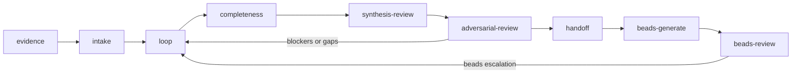
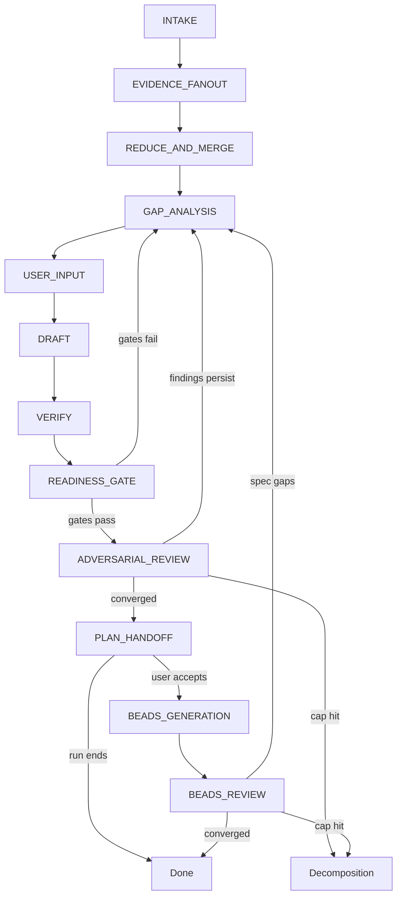
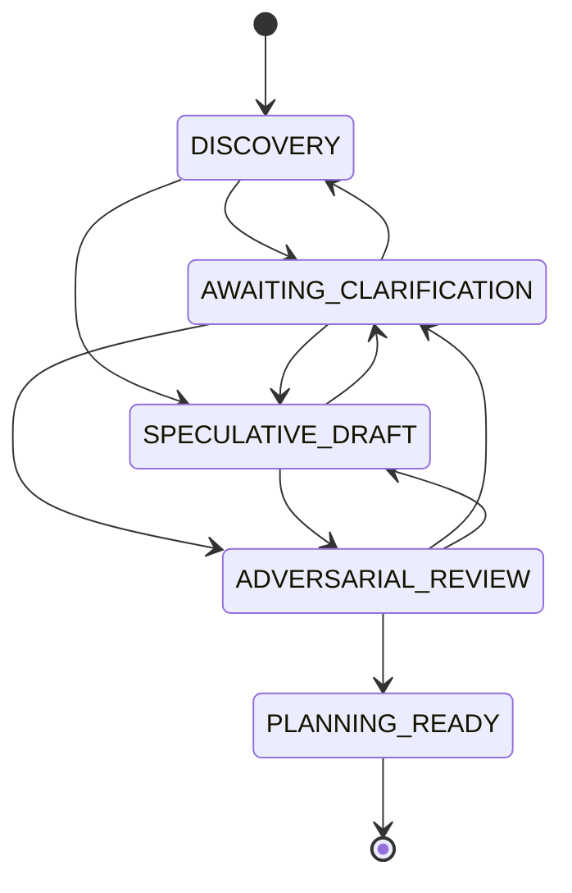

# Trace

Trace turns a feature request, codebase, or conversation transcript into a
rigorous, implementation-ready specification. It uses AI sub-agents to gather
evidence, challenge assumptions, and produce a plan you can hand off to an
engineer or another agent.

It runs as a skill pack for [Claude Code](https://docs.anthropic.com/en/docs/claude-code)
and [Codex](https://github.com/openai/codex).

> **See an example output:** [`specs/feature-flags-system.md`](specs/feature-flags-system.md)
> is a finished spec with full artifacts in
> [`specs/_artifacts/feature-flags-system/`](specs/_artifacts/feature-flags-system/).

## Prerequisites

- Claude Code (`claude`) or Codex (`codex`)
- `bash`, `git`, `python3` (for manual/shell install only)

## Install

### Claude Code (recommended)

```
/plugin marketplace add mwarger/trace
/plugin install trace@trace-dev
```

All 9 skills are available immediately. Update with `/plugin update trace`.

### Codex

```
Fetch and follow instructions from https://raw.githubusercontent.com/mwarger/trace/main/.codex/INSTALL.md
```

### Manual / shell

```bash
./install.sh
```

This installs the skills into your detected skills dir and a helper command `trace-pack`.

Useful env vars:

```bash
TRACE_INSTALL_MODE=copy ./install.sh
TRACE_SKILLS_DIR="$HOME/.claude/skills" ./install.sh
TRACE_SKILLS_DIR="$HOME/.codex/skills" ./install.sh
```

Remote install:

```bash
curl -fsSL "https://raw.githubusercontent.com/mwarger/trace/main/install.sh?$(date +%s)" | bash
```

Platform-specific install docs:
- Claude Code: [`.claude/INSTALL.md`](.claude/INSTALL.md)
- Codex: [`.codex/INSTALL.md`](.codex/INSTALL.md)

## How to kick it off

Start a new session after install and ask for one of these:

```text
Create a subject-named spec for this feature request using Trace.
Reverse engineer this repo into a Trace spec with sidecar artifacts.
Take this transcript and build a planning-ready subject spec.
Use the trace-orchestrator skill on this codebase.
```

Works in both Claude Code (`claude`) and Codex (`codex`). If the install
worked, the orchestrator skill should trigger and then route into the focused
sub-skills.

After changing the skill pack, restart the agent session before testing again.
Do not trust a run that still writes old policy markers such as `trace-v1`.

## What gets installed

This repo installs 9 skills:
- `trace-orchestrator`
- `spec-intake`
- `spec-loop`
- `spec-completeness`
- `spec-synthesis-review`
- `spec-adversarial-review`
- `spec-plan-handoff`
- `spec-beads-generate`
- `spec-beads-review`

The installer auto-detects the target platform:
- If `~/.claude/` exists → installs to `~/.claude/skills/`
- If `~/.codex/` exists → installs to `~/.codex/skills/`
- Override with `TRACE_SKILLS_DIR`

By default the installer uses symlinks so local edits in this repo are visible
immediately in the installed skills.

## Helper command

After install, this command should be available:

```bash
trace-pack help
```

Supported commands:
- `help`
- `where`
- `list-skills`
- `install-skills`
- `uninstall-skills`
- `doctor`
- `smoke-test`
- `test-local`

## Testing

### Smoke test

To verify the repo structure and example artifacts:

```bash
./scripts/smoke-test.sh
# or
trace-pack smoke-test
```

The smoke test checks:
- expected skill folders exist
- expected spec files exist
- the root specs index uses the managed Trace block
- managed JSON files parse
- managed JSONL ledgers parse

### Local isolated testing

If you want to test without touching your normal setup:

```bash
./scripts/test-local.sh
# or
trace-pack test-local
```

That creates `.local-test/skills` and installs the skills there instead of your
normal skills directory. Then launch your agent from the same shell with:

```bash
TRACE_SKILLS_DIR="$(pwd)/.local-test/skills" claude
# or
TRACE_SKILLS_DIR="$(pwd)/.local-test/skills" codex
```

This isolates the test from your normal skills and other installed scripts.

## Uninstall

To remove the installed wrapper and managed skills:

```bash
./uninstall.sh
# or
trace-pack uninstall-skills
```

---

## How it works

### Glossary

| Term | Meaning |
|------|---------|
| **Subject spec** | A specification document named after its subject (e.g. `auth-session-system.md`). The primary output of a Trace run. |
| **Evidence** | Any input material — code, docs, transcripts, screenshots, URLs, or user statements — that the spec is built from. |
| **Canon** | The authoritative merged state of the spec. Only the lead agent (the "reducer") writes to canon. |
| **Reducer** | The lead agent role that merges sub-agent outputs into the canonical spec. Sub-agents explore and review; only the reducer writes final text. |
| **Sub-agent** | A spawned agent that performs bounded exploration, review, or adversarial testing. Reports findings back to the reducer. |
| **Provenance** | A trace from any canonical claim back to the evidence that supports it. Required before text becomes part of canon. |
| **Beads** | Discrete implementation work units (`br` beads) decomposed from the plan, with dependency wiring and spec-claim mapping. |
| **Evidence ledger** | A JSONL log of every evidence unit processed during a run. |

### Inspiration

Trace takes inspiration from marginalia as a reading and synthesis method, then
pushes that idea into evidence-led specification, reducer-based merges, and
sub-agent-assisted planning.

The pack is built around 5 ideas:
- everything starts as evidence
- the lead agent is the only reducer of canon
- sub-agents do most bounded exploration and review work
- provenance is required before text becomes canonical
- readiness is a canonical state machine, not just a score threshold

### Pipeline



### Anatomy of a run

A single Trace run moves through 12 phases. Most are sequential, but the loop-back paths and optional beads fork create the real flow:



| Phase | Purpose | Exit criterion |
|-------|---------|----------------|
| `INTAKE` | Normalize inputs, classify archetype, seed evidence ledger | Subject slug + readiness skeleton created |
| `EVIDENCE_FANOUT` | Sub-agent exploration of evidence sources | All evidence units collected |
| `REDUCE_AND_MERGE` | Canonical merge of sub-agent outputs | Single rolling summary with provenance |
| `GAP_ANALYSIS` | Identify missing coverage across dimensions | Gap list emitted or empty |
| `USER_INPUT` | Ask clarifying questions matched to archetype profile | User responds or skips |
| `DRAFT` | Write or rewrite spec sections from evidence | All sections drafted with provenance |
| `VERIFY` | Check draft against acceptance criteria | Verification pass/fail recorded |
| `READINESS_GATE` | Score against 12-dimension ontology, enforce 80/80 gates | Both scores ≥ 80 and blocker_reasons empty |
| `ADVERSARIAL_REVIEW` | Stress-test via dynamic agent teams | Zero material findings or cap hit |
| `PLAN_HANDOFF` | Render implementation plan (or withheld handoff if blocked) | Plan delivered to user |
| `BEADS_GENERATION` | Decompose plan into beads with dependency wiring | beads-manifest.json emitted |
| `BEADS_REVIEW` | Stress-test beads for coverage, granularity, dependencies | Zero findings or cap hit |

### Canonical readiness model

Trace separates planning state from handoff state.

Planning states:
- `DISCOVERY`
- `AWAITING_CLARIFICATION`
- `SPECULATIVE_DRAFT`
- `ADVERSARIAL_REVIEW`
- `PLANNING_READY`

Handoff states:
- `WITHHELD`
- `ELIGIBLE`

Important rules:
- scores do not override blocker reasons
- sparse prompts may still draft, but blocked runs must keep handoff withheld
- analogy prompts should trigger clarifying questions unless the critical
  product decisions are already explicit
- speculative uncertainty should become bounded variants, not fake certainty
- sparse analogy prompts with zero question rounds must not become
  `PLANNING_READY`

### State transitions



Scores do not override blocker reasons. Entry to ADVERSARIAL_REVIEW requires both blocker_reasons empty and completeness/confidence scores ≥ 80. PLANNING_READY is only reachable when all agents report zero material findings.

### Decision model

#### Request archetypes

The archetype determines clarification intensity and evidence expectations:

| Archetype | Description |
|-----------|-------------|
| `feature` | New feature development |
| `analogy_feature` | Feature based on analogy to existing patterns |
| `parity_clone` | Replicating an existing system |
| `integration` | Integration with external systems |
| `bugfix` | Bug fix work |
| `migration` | Migration work |
| `refactor` | Refactoring work |
| `reverse_spec` | Specifying from existing code |

#### Evidence density

Classified at intake. Routes clarification intensity:

- **`sparse`** — minimal evidence; expect multiple question rounds
- **`mixed`** — moderate evidence; targeted questions only
- **`dense`** — comprehensive evidence; may skip clarification entirely

#### Critical decision buckets

All 5 must be closed before a run can enter ADVERSARIAL_REVIEW:

1. **`core_outcome`** — the fundamental outcome being delivered
2. **`scope_boundary`** — what is in and out of scope
3. **`implementation_constraints`** — technical or business constraints
4. **`dependencies_and_integrations`** — external system dependencies
5. **`acceptance_signal`** — how success is measured

A sparse analogy/parity request with zero question rounds can never reach PLANNING_READY — there is not enough signal to close all 5 buckets without user input.

### Adversarial review

The adversarial review stage is the key gate before a spec becomes planning-ready. Dynamic agent teams are assembled per-run: section agents probe individual spec areas for depth, while cross-cutting agents check coherence across the whole document. Review proceeds in convergence-based rounds — agents continue until findings reach zero or the round cap is hit. If material findings persist at the cap, the spec is sent back for revision or flagged for decomposition into smaller subjects.

**Agent team composition:**

| Agent type | Role | Count |
|------------|------|-------|
| Section agents | Probe individual spec areas (core flows, entity/state, interfaces, constraints, security, acceptance criteria, data model, migration) | 3–10 per run |
| Literal implementer | "If I built exactly what this says with zero context, what would go wrong?" | 1 (cross-cutting) |
| QA adversary | "What claims are untestable? What edge cases have no defined behavior?" | 1 (cross-cutting) |
| Consistency checker | "Where does section X contradict or assume something incompatible with section Y?" | 1 (cross-cutting) |

**Convergence model:** min 2 rounds (1 if round 1 is clean), max 5. Exit when all agents independently report zero material findings. Hitting the 5-round cap triggers `decomposition_required` — it is not an acceptable exit.

### Beads pipeline

Beads are an optional post-handoff step — the user is prompted after plan delivery.

**Generation** decomposes the implementation plan into beads: one epic per spec subject, one bead per discrete work unit. Each bead carries dependency wiring, provenance labels (`trace:<subject-slug>`), and an explicit mapping back to spec claims. Every spec claim must map to at least one bead. Output: `beads-manifest.json`.

**Review** stress-tests the beads with a 4-agent team:

| Agent | Focus |
|-------|-------|
| Coverage | Every spec claim and acceptance criterion has a bead |
| Granularity | Each bead is properly sized (not too coarse, not too fine) |
| Dependency | Cycle detection and dependency graph structure |
| Actionability | TDD-readiness, test boundaries, literal implementability |

Same convergence model as adversarial review: min 2 rounds, max 5, exit on zero findings, cap = decomposition signal. Beads review can surface spec gaps that adversarial review missed — these escalate back to the spec-loop via `beads-escalation.json`.

### Skills

| Skill | Role |
|-------|------|
| `trace-orchestrator` | Top-level orchestrator — routes through sub-skills, manages state transitions, acts as the sole reducer of canon |
| `spec-intake` | Normalize inputs into a subject spec run — classify archetype, seed evidence ledger, create readiness skeleton |
| `spec-loop` | Process evidence one unit at a time, ask clarifying questions, emit speculative variants when blockers remain |
| `spec-completeness` | Score the spec against a 12-dimension ontology with sub-signal requirements, enforce 80/80 gates |
| `spec-synthesis-review` | Merge sub-agent outputs into canon, run 4 review passes (completeness, contradiction, provenance, implementability) |
| `spec-adversarial-review` | Stress-test the spec with dynamic agent teams — section agents for depth, cross-cutting agents for coherence — until zero findings or decomposition |
| `spec-plan-handoff` | Render the implementation plan if eligible, or emit a withheld handoff with next steps if blocked |
| `spec-beads-generate` | Decompose implementation plan into beads with dependency wiring, epic grouping, and provenance labels |
| `spec-beads-review` | Stress-test beads for coverage, granularity, dependencies, and actionability using adversarial agent teams |

## Root specs index contract

Every successful Trace run should leave behind:
- a subject spec at `specs/<subject>.md`
- a matching row in `specs/README.md`

Trace manages the subject rows inside:
- `<!-- trace:spec-index:start -->`
- `<!-- trace:spec-index:end -->`

Human notes outside that block should be preserved.

Rows should surface:
- planning status
- handoff status
- subject purpose

## Repo layout

```text
.claude/
  INSTALL.md
.claude-plugin/
  plugin.json
  marketplace.json
.codex/
  INSTALL.md
docs/
  superpowers/
skills/
  trace-orchestrator/
  spec-intake/
  spec-loop/
  spec-completeness/
  spec-synthesis-review/
  spec-adversarial-review/
  spec-plan-handoff/
  spec-beads-generate/
  spec-beads-review/
specs/
  README.md
  analytics-module.md
  feature-flags-system.md
  auth-session-system.md
  _artifacts/
scripts/
  cli.sh
  smoke-test.sh
  test-local.sh
.gitignore
install.sh
uninstall.sh
LICENSE
```
